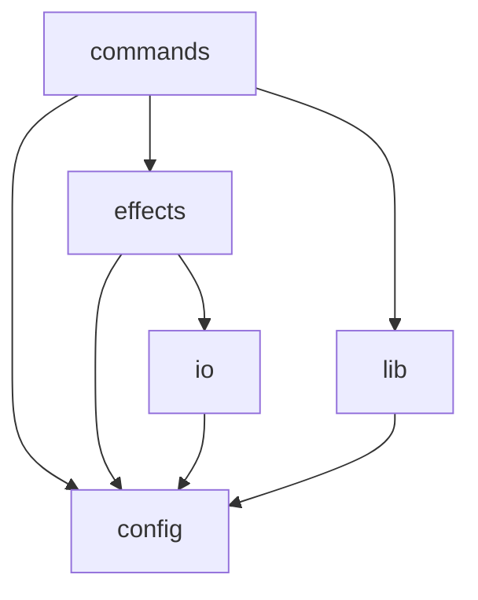

# Kris Kringle


<p align="right">
    <code>0% cov</code>&nbsp;
    <code>155 sloc</code>&nbsp;
    <code>17 files</code>&nbsp;
    <code>4 deps</code>&nbsp;
    <code>5 dev deps</code>
</p>

Christmas gift-giving made easy by randomising a draw and notifying players of their KK by SMS text message.

<!-- START doctoc generated TOC please keep comment here to allow auto update -->
<!-- DON'T EDIT THIS SECTION, INSTEAD RE-RUN doctoc TO UPDATE -->
## Table of Contents

- [Install](#install)
- [Usage](#usage)
- [Example](#example)
- [Architecture](#architecture)

<!-- END doctoc generated TOC please keep comment here to allow auto update -->

## Install

###### <p align="right"><a href="https://www.npmjs.com/package/kris-kringle">https://www.npmjs.com/package/kris-kringle</a></p>
```
npm install kris-kringle
```

SMS notifications are sent using AWS SNS and requires an AWS profile to be configured.

## Usage

```
kk <configJsonFile>
```

`configJsonFile` defaults to `config.json`.

## Example

###### <p align="right"><a href="https://github.com/mattriley/node-kris-kringle/blob/master/config-example.json">config-example.json</a></p>
```json
{
    "dryRun": true,
    "template": "Hey {name}! Your KK is {kk}. The spend is ${spend}. Merry Christmas! 🎅🏻🎄",
    "spend": 100,
    "players": [
        {
            "name": "foo",
            "number": "+6111111111"
        },
        {
            "name": "bar",
            "number": "+6122222222"
        },
        {
            "name": "baz",
            "number": "+6133333333"
        }
    ]
}
```

Text messages:

- Hey foo! Your KK is baz. The spend is $100. Merry Christmas! 🎅🏻🎄
- Hey bar! Your KK is foo. The spend is $100. Merry Christmas! 🎅🏻🎄
- Hey baz! Your KK is bar. The spend is $100. Merry Christmas! 🎅🏻🎄

See [`src/default-config.json`](https://github.com/mattriley/kris-kringle/blob/master/src/default-config.json) for other config options.

## Architecture

###### <p align="right"><em>Can't see the diagram?</em> <a id="link-1" href="https://github.com/mattriley/node-kris-kringle#user-content-link-1">View it on GitHub</a></p>

