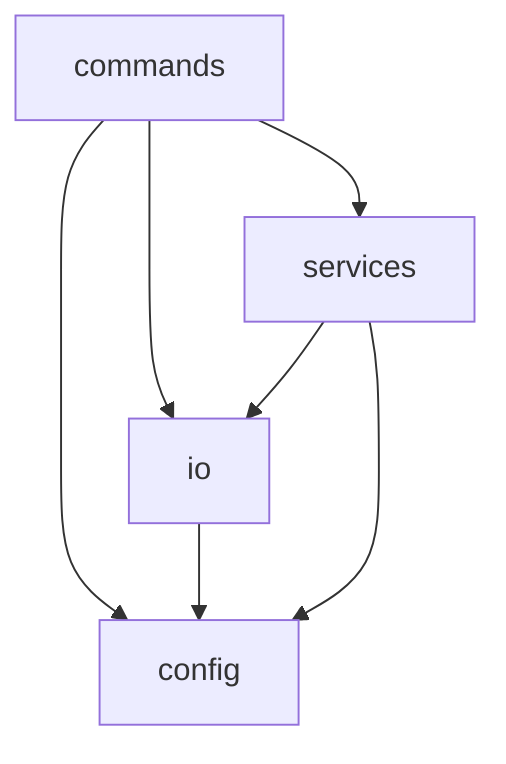

# Kris Kringle

Christmas gift-giving made easy by randomising a draw and notifying players of their KK by SMS text message.

## Table of Contents

<!-- START doctoc generated TOC please keep comment here to allow auto update -->
<!-- DON'T EDIT THIS SECTION, INSTEAD RE-RUN doctoc TO UPDATE -->

- [Install](#install)
- [Usage](#usage)
- [Example](#example)
- [Architecture](#architecture)

<!-- END doctoc generated TOC please keep comment here to allow auto update -->

## Install

```
npm install kris-kringle
```

SMS notifications are sent using AWS SNS and requires an AWS profile to be configured.

## Usage

```
kk [config-json-path]
```

`config-json-path` defaults to `config.json`.

## Example

<details open>
<summary>config-example.json</summary>

```js
{
    "dryRun": true,
    "template": "Hey {name}! Your KK is {kk}. The spend is ${spend}. Merry Christmas! 🎅🏻🎄",
    "spend": 100,
    "players": [
        {
            "name": "foo",
            "number": "+6111111111"
        },
        {
            "name": "bar",
            "number": "+6122222222"
        },
        {
            "name": "baz",
            "number": "+6133333333"
        }
    ]
}
```
</details>

Text messages:

- Hey foo! Your KK is baz. The spend is $100. Merry Christmas! 🎅🏻🎄
- Hey bar! Your KK is foo. The spend is $100. Merry Christmas! 🎅🏻🎄
- Hey baz! Your KK is bar. The spend is $100. Merry Christmas! 🎅🏻🎄

See [`src/default-config.json`](https://github.com/mattriley/kris-kringle/blob/master/src/default-config.json) for other config options.

## Architecture


